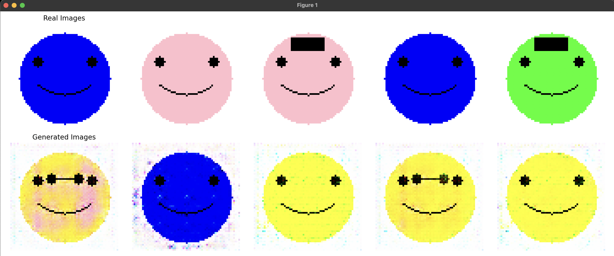

# DCGAN-smiles



---

# Elevating GANs: Transitioning from Basic GANs to DCGANs

[In our previous exploration](https://github.com/ranfysvalle02/smiley-GAN/), we delved into the foundational aspects of **Generative Adversarial Networks (GANs)**, understanding their architecture, training dynamics, and applications. GANs have been a groundbreaking innovation in the realm of generative modeling, enabling the creation of realistic images, audio, and more. However, as with any powerful tool, scaling GANs to handle more complex tasks introduces new challenges. In this follow-up post, we embark on enhancing our basic GAN to a **Deep Convolutional GAN (DCGAN)**, examining the transformative changes and the valuable lessons learned along the way—especially concerning computational resource management.

## Table of Contents

1. [Recap: The Basic GAN](#recap-the-basic-gan)
2. [Introducing DCGANs](#introducing-dcgan)
3. [Transforming Our GAN to a DCGAN](#transforming-our-gan-to-a-dcgan)
4. [Challenges Encountered: Resource Intensity](#challenges-encountered-resource-intensity)
5. [Optimizing DCGAN Performance](#optimizing-dcgan-performance)
6. [Key Learnings and Best Practices](#key-learnings-and-best-practices)
7. [Conclusion](#conclusion)

---

## [Recap: The Basic GAN](https://github.com/ranfysvalle02/smiley-GAN/)

In our initial venture, we implemented a **Basic GAN** capable of generating simple smiley face images. This GAN comprised:

- **Generator**: A neural network using fully connected (linear) layers to transform a latent vector (random noise) into image data.
- **Discriminator**: A neural network also utilizing fully connected layers to differentiate between real and generated images.

While effective for generating rudimentary images, the Basic GAN had limitations in capturing intricate spatial features and producing high-fidelity outputs.

---


## Introducing DCGANs

**Deep Convolutional GANs (DCGANs)**, introduced by Radford, Metz, and Chintala in their seminal [2015 paper](https://arxiv.org/abs/1511.06434), revolutionized GAN architectures by integrating deep convolutional neural networks (CNNs). DCGANs leverage the hierarchical feature extraction capabilities of CNNs, enabling the generation of more detailed and realistic images.

**Key Features of DCGANs:**

1. **Convolutional Layers**: Replace fully connected layers with convolutional and transposed convolutional layers, enhancing spatial feature learning.
2. **Strided and Fractional-Strided Convolutions**: Utilize for downsampling (in Discriminator) and upsampling (in Generator) instead of pooling layers.
3. **Batch Normalization**: Applied to stabilize training by normalizing layer inputs.
4. **Activation Functions**:
   - **Generator**: ReLU activations in hidden layers and Tanh in the output layer.
   - **Discriminator**: LeakyReLU activations to allow a small gradient when the unit is not active.
5. **No Pooling Layers**: Strided convolutions replace pooling to maintain spatial information.

By adopting these features, DCGANs achieve superior image quality and training stability compared to their basic counterparts.

---

## Transforming Our GAN to a DCGAN

Transitioning from a Basic GAN to a DCGAN involved several pivotal changes:

### 1. **Architectural Overhaul**

**Generator:**
- **From**: Fully connected layers.
- **To**: Transposed convolutional layers (`nn.ConvTranspose2d`) for upsampling the latent vector into an image.
- **Benefits**: Enhanced ability to generate spatial hierarchies and more detailed images.

**Discriminator:**
- **From**: Fully connected layers.
- **To**: Convolutional layers (`nn.Conv2d`) for downsampling and feature extraction.
- **Benefits**: Improved capability to discern complex spatial patterns and features in images.

### 2. **Image Size Adjustment**

- **Basic GAN**: 28x28 pixels.
- **DCGAN**: Increased to 64x64 pixels.
  
**Rationale**: Larger images allow for more detailed and visually appealing outputs, leveraging the convolutional layers' strengths.

### 3. **Normalization and Activation Functions**

- **Batch Normalization**: Integrated after each convolutional layer in both Generator and Discriminator to stabilize training and accelerate convergence.
- **Activation Functions**: Adopted ReLU and LeakyReLU as per DCGAN guidelines to introduce non-linearity and maintain gradient flow.

### 4. **Data Preparation Enhancements**

- **Image Normalization**: Scaled image pixel values to the range [-1, 1] to align with the Generator's Tanh activation output.
- **Dataset Generation**: Adapted to accommodate the increased image size, ensuring that smiley faces are proportionally scaled and features are appropriately detailed.

### 5. **Training Loop Adjustments**

- **Manual Optimization**: Continued using manual optimization to control the training steps of both networks explicitly.
- **Label Smoothing**: Applied to real labels to prevent the Discriminator from becoming overly confident, enhancing training stability.

### Updated DCGAN Code Snippet

Here's a glimpse of the key changes in the DCGAN implementation:

```python
class Generator(nn.Module):
    def __init__(self, latent_dim: int, img_channels: int = 3, feature_map_size: int = 64):
        super(Generator, self).__init__()
        self.net = nn.Sequential(
            nn.ConvTranspose2d(latent_dim, feature_map_size * 8, kernel_size=4, stride=1, padding=0, bias=False),
            nn.BatchNorm2d(feature_map_size * 8),
            nn.ReLU(True),
            # Additional ConvTranspose2d layers...
            nn.ConvTranspose2d(feature_map_size, img_channels, kernel_size=4, stride=2, padding=1, bias=False),
            nn.Tanh()
        )
    
    def forward(self, x: torch.Tensor) -> torch.Tensor:
        return self.net(x)

class Discriminator(nn.Module):
    def __init__(self, img_channels: int = 3, feature_map_size: int = 64):
        super(Discriminator, self).__init__()
        self.net = nn.Sequential(
            nn.Conv2d(img_channels, feature_map_size, kernel_size=4, stride=2, padding=1, bias=False),
            nn.LeakyReLU(0.2, inplace=True),
            # Additional Conv2d layers...
            nn.Conv2d(feature_map_size * 8, 1, kernel_size=4, stride=1, padding=0, bias=False),
            nn.Sigmoid()
        )
    
    def forward(self, x: torch.Tensor) -> torch.Tensor:
        return self.net(x).view(-1, 1).squeeze(1)
```

---

## Challenges Encountered: Resource Intensity

While upgrading to a DCGAN brought substantial improvements in image quality, it introduced significant **computational challenges**:

### 1. **Increased Computational Load**

- **Larger Image Size**: Moving from 28x28 to 64x64 pixels increased the number of parameters and computations exponentially.
- **Deeper Networks**: The addition of multiple convolutional layers in both Generator and Discriminator amplified the computational demands.

### 2. **Hardware Strain**

- **CPU/GPU Utilization**: Intensive computations led to higher CPU/GPU usage, causing noticeable system lag and increased power consumption.
- **Thermal Management**: Prolonged high-intensity processing resulted in elevated system temperatures, triggering cooling mechanisms (e.g., fans ramping up).

### 3. **Memory Consumption**

- **GPU Memory (VRAM)**: Larger models and higher-resolution images consumed more VRAM, potentially leading to memory bottlenecks, especially on systems with limited GPU resources.
- **Batch Size Constraints**: Maintaining the same batch size (64) became challenging due to the increased memory footprint per image.

### 4. **Extended Training Times**

- **Longer Epochs**: Each training epoch took significantly more time, prolonging the overall training duration.
- **Monitoring and Debugging**: Increased computational steps made monitoring training progress more resource-intensive and time-consuming.

**Personal Experience:** During DCGAN training, I observed my laptop's fans spinning at higher speeds and the system becoming noticeably warmer. Additionally, the training process was markedly slower compared to the Basic GAN, underscoring the heightened resource requirements.

---

## Optimizing DCGAN Performance

To mitigate the resource challenges posed by the DCGAN, I implemented several optimization strategies without compromising the model's performance and output quality.

### 1. **Leveraging GPU Acceleration**

**Why?** GPUs are inherently designed for parallel processing, making them significantly faster for training deep learning models compared to CPUs.

**Implementation:**

- **Check for GPU Availability:**

  ```python
  device = torch.device("cuda" if torch.cuda.is_available() else "cpu")
  model.to(device)
  ```

- **Ensure Data and Model are on GPU:**

  ```python
  real_images = real_images.to(device)
  z = torch.randn(batch_size, latent_dim, 1, 1, device=device)
  ```

### 2. **Reducing Model Complexity**

**Approach:**

- **Fewer Layers or Filters:** Decreasing the number of convolutional layers or the number of filters per layer can significantly reduce computational load.
- **Example Adjustment:**

  ```python
  feature_map_size = 32  # Reduced from 64
  ```

**Trade-off:** While this reduces resource consumption, it may slightly impact the quality and detail of generated images.

### 3. **Adjusting Batch Size**

**Strategy:**

- **Smaller Batches:** Reducing the batch size decreases memory usage, allowing for smoother training on GPUs with limited VRAM.

  ```python
  BATCH_SIZE = 32  # Reduced from 64
  ```

**Consideration:** Smaller batches can lead to noisier gradient estimates, potentially affecting training stability and convergence speed.

### 4. **Mixed Precision Training**

**Benefits:**

- **Memory Efficiency:** Utilizes 16-bit floating-point numbers instead of 32-bit, reducing memory usage.
- **Speed:** Can accelerate training on compatible hardware.

**Implementation with PyTorch Lightning:**

```python
trainer = pl.Trainer(
    max_epochs=EPOCHS,
    accelerator='auto',
    devices=1,
    precision=16,  # Enable mixed precision
    logger=False,
    callbacks=[checkpoint_callback],
    enable_progress_bar=True,
    enable_model_summary=False
)
```

### 5. **Efficient Data Loading**

**Techniques:**

- **Increase `num_workers`:** Utilizing multiple worker processes can speed up data loading.
- **Enable `pin_memory`:** Accelerates data transfer to GPU.

  ```python
  dataloader = DataLoader(dataset, batch_size=BATCH_SIZE, shuffle=True, num_workers=4, pin_memory=True)
  ```

### 6. **Early Stopping and Checkpointing**

**Purpose:**

- **Early Stopping:** Halts training when performance metrics plateau, saving time and resources.
- **Checkpointing:** Saves intermediate models, allowing resumption without restarting training from scratch.

**Implementation:**

```python
checkpoint_callback = pl.callbacks.ModelCheckpoint(
    dirpath=CHECKPOINT_DIR,
    filename='best-checkpoint',
    save_top_k=1,
    verbose=False,
    monitor='g_loss',
    mode='min'
)

trainer = pl.Trainer(
    # ... other parameters ...
    callbacks=[checkpoint_callback],
    # ... other parameters ...
)
```

### 7. **Profiling and Monitoring**

**Tools:**

- **PyTorch Profiler:** Identify bottlenecks in the training process.
- **NVIDIA Nsight Systems:** For detailed GPU performance analysis.

**Implementation:**

```python
with torch.profiler.profile(
    activities=[
        torch.profiler.ProfilerActivity.CPU,
        torch.profiler.ProfilerActivity.CUDA,
    ],
    record_shapes=True,
    profile_memory=True,
    with_stack=True
) as prof:
    # Training loop or a single forward pass
    model(z)

print(prof.key_averages().table(sort_by="cuda_time_total"))
```

**Benefit:** Pinpoint inefficiencies and optimize specific components of the model or training process.

---

## Key Learnings and Best Practices

Through this transformation and optimization journey, several key insights emerged:

1. **Architectural Choices Matter:** Transitioning to convolutional layers significantly enhances image quality but demands more computational power. Balancing depth and complexity with available resources is crucial.

2. **Hardware Utilization:** Maximizing GPU capabilities through proper configuration (e.g., ensuring models and data are on GPU) can drastically reduce training times and handle larger models efficiently.

3. **Batch Size Optimization:** Adjusting batch sizes based on hardware limitations can prevent memory bottlenecks while maintaining training efficacy.

4. **Mixed Precision Training:** Leveraging mixed precision can offer substantial memory and speed benefits, especially on modern GPUs that support it.

5. **Efficient Data Handling:** Optimizing data loaders with appropriate `num_workers` and `pin_memory` settings can enhance data throughput, ensuring that the GPU remains utilized without waiting for data.

6. **Monitoring and Profiling:** Regularly profiling training processes helps identify and address performance bottlenecks, leading to more efficient training cycles.

7. **Iterative Testing:** Implementing changes incrementally and testing their impact allows for a better understanding of how each modification affects both performance and resource usage.

8. **Stay Updated with Best Practices:** The field of deep learning is rapidly evolving. Staying informed about the latest optimization techniques and architectural innovations can provide significant advantages.

---

## Conclusion

Transitioning from a Basic GAN to a DCGAN marked a significant leap in both the quality of generated images and the complexity of the training process. While DCGANs offer superior capabilities in capturing detailed spatial features and producing realistic outputs, they also introduce challenges related to computational resource demands. Through strategic optimizations—such as leveraging GPU acceleration, adjusting model complexity, implementing mixed precision training, and enhancing data loading—we can harness the full potential of DCGANs without overburdening our hardware.

This journey underscores the delicate balance between model sophistication and resource management, a balance that is pivotal in the practical deployment of deep learning models. As we continue to explore and innovate within the realm of generative models, these insights will guide us in building more efficient, effective, and scalable solutions.

Whether you're enhancing existing models or embarking on new generative projects, understanding and applying these optimizations will empower you to create high-quality outputs while maintaining optimal performance. Happy modeling!
