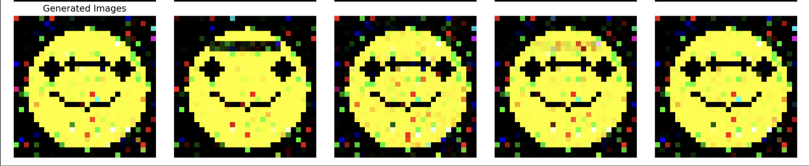

# DCGAN-smiles


---

# Elevating GANs: From Basic GANs to DCGANs

In the [previous post](https://github.com/ranfysvalle02/smiley-GAN/), we introduced the basics of **Generative Adversarial Networks (GANs)** by creating a simple model that generated basic smiley faces. This initial exploration provided a solid foundation, but to achieve more realistic and detailed images, we needed to enhance our approach. Enter the **Deep Convolutional GAN (DCGAN)**—a more sophisticated architecture that leverages the power of convolutional neural networks to produce higher quality images.

## Table of Contents

1. [Recap: The Basic GAN](#recap-the-basic-gan)
2. [Introducing DCGANs](#introducing-dcgan)
3. [Transforming Our GAN to a DCGAN](#transforming-our-gan-to-a-dcgan)
4. [Challenges Encountered: Resource Intensity](#challenges-encountered-resource-intensity)
5. [Optimizing DCGAN Performance](#optimizing-dcgan-performance)
6. [Key Learnings and Best Practices](#key-learnings-and-best-practices)
7. [Conclusion](#conclusion)

---

## [Recap: The Basic GAN](https://github.com/ranfysvalle02/smiley-GAN/)

In our initial venture, we implemented a **Basic GAN** capable of generating simple smiley face images. This GAN comprised:

- **Generator**: A neural network using fully connected (linear) layers to transform a latent vector (random noise) into image data.
- **Discriminator**: A neural network also utilizing fully connected layers to differentiate between real and generated images.



While effective for generating rudimentary images, the Basic GAN had limitations in capturing intricate spatial features and producing high-fidelity outputs.

---


## Introducing DCGANs

**Deep Convolutional GANs (DCGANs)**, introduced by Radford, Metz, and Chintala in their [2015 paper](https://arxiv.org/abs/1511.06434), represent a significant advancement in GAN architectures. By integrating deep convolutional neural networks (CNNs), DCGANs enhance the model's ability to generate detailed and realistic images.

**Key Features of DCGANs:**

1. **Convolutional Layers**: Replace fully connected layers with convolutional and transposed convolutional layers, improving spatial feature learning.
2. **Strided and Fractional-Strided Convolutions**: Utilize strides for downsampling and upsampling instead of pooling layers, maintaining spatial information.
3. **Batch Normalization**: Applied to stabilize training by normalizing layer inputs.
4. **Activation Functions**:
   - **Generator**: ReLU activations in hidden layers and Tanh in the output layer.
   - **Discriminator**: LeakyReLU activations to allow a small gradient when neurons are not active.
5. **No Pooling Layers**: Strided convolutions handle scaling, making pooling unnecessary.

By adopting these features, DCGANs achieve superior image quality and training stability compared to their basic counterparts.

---


## Transforming Our GAN to a DCGAN

Transitioning from a Basic GAN to a DCGAN involved several pivotal changes. Here's a breakdown of the key modifications:

### 1. **Architectural Overhaul**

**Generator:**
- **From**: Fully connected layers.
- **To**: Transposed convolutional layers (`nn.ConvTranspose2d`) for upsampling the latent vector into an image.
- **Benefits**: Enhanced ability to generate spatial hierarchies and more detailed images.

**Discriminator:**
- **From**: Fully connected layers.
- **To**: Convolutional layers (`nn.Conv2d`) for downsampling and feature extraction.
- **Benefits**: Improved capability to discern complex spatial patterns and features in images.

### 2. **Image Size Adjustment**

- **Basic GAN**: 28x28 pixels.
- **DCGAN**: Increased to 64x64 pixels.
  
**Rationale**: Larger images allow for more detailed and visually appealing outputs, leveraging the convolutional layers' strengths.

### 3. **Normalization and Activation Functions**

- **Batch Normalization**: Integrated after each convolutional layer in both Generator and Discriminator to stabilize training and accelerate convergence.
- **Activation Functions**: Adopted ReLU and LeakyReLU as per DCGAN guidelines to introduce non-linearity and maintain gradient flow.

### 4. **Data Preparation Enhancements**

- **Image Normalization**: Scaled image pixel values to the range [-1, 1] to align with the Generator's Tanh activation output.
- **Dataset Generation**: Adapted to accommodate the increased image size, ensuring that smiley faces are proportionally scaled and features are appropriately detailed.

### 5. **Training Loop Adjustments**

- **Manual Optimization**: Continued using manual optimization to control the training steps of both networks explicitly.
- **Label Smoothing**: Applied to real labels to prevent the Discriminator from becoming overly confident, enhancing training stability.

### Updated DCGAN Code Snippet

```python
class Generator(nn.Module):
    """
    DCGAN Generator
    Transforms a random noise vector into a structured image using transposed convolutions.
    """
    def __init__(self, latent_dim: int, img_channels: int = 3, feature_map_size: int = 64):
        super(Generator, self).__init__()
        self.net = nn.Sequential(
            # Input: (latent_dim) x 1 x 1
            nn.ConvTranspose2d(latent_dim, feature_map_size * 8, kernel_size=4, stride=1, padding=0, bias=False),
            nn.BatchNorm2d(feature_map_size * 8),
            nn.ReLU(True),
            # State: (feature_map_size*8) x 4 x 4

            nn.ConvTranspose2d(feature_map_size * 8, feature_map_size * 4, kernel_size=4, stride=2, padding=1, bias=False),
            nn.BatchNorm2d(feature_map_size * 4),
            nn.ReLU(True),
            # State: (feature_map_size*4) x 8 x 8

            nn.ConvTranspose2d(feature_map_size * 4, feature_map_size * 2, kernel_size=4, stride=2, padding=1, bias=False),
            nn.BatchNorm2d(feature_map_size * 2),
            nn.ReLU(True),
            # State: (feature_map_size*2) x 16 x 16

            nn.ConvTranspose2d(feature_map_size * 2, feature_map_size, kernel_size=4, stride=2, padding=1, bias=False),
            nn.BatchNorm2d(feature_map_size),
            nn.ReLU(True),
            # State: (feature_map_size) x 32 x 32

            nn.ConvTranspose2d(feature_map_size, img_channels, kernel_size=4, stride=2, padding=1, bias=False),
            nn.Tanh()
            # Output: (img_channels) x 64 x 64
        )

    def forward(self, x: torch.Tensor) -> torch.Tensor:
        return self.net(x)

# =========================================
# DCGAN Discriminator Definition
# =========================================

class Discriminator(nn.Module):
    """
    DCGAN Discriminator
    Evaluates whether an image is real or fake using deep convolutional layers.
    """
    def __init__(self, img_channels: int = 3, feature_map_size: int = 64):
        super(Discriminator, self).__init__()
        self.net = nn.Sequential(
            # Input: (img_channels) x 64 x 64
            nn.Conv2d(img_channels, feature_map_size, kernel_size=4, stride=2, padding=1, bias=False),
            nn.LeakyReLU(0.2, inplace=True),
            # State: (feature_map_size) x 32 x 32

            nn.Conv2d(feature_map_size, feature_map_size * 2, kernel_size=4, stride=2, padding=1, bias=False),
            nn.BatchNorm2d(feature_map_size * 2),
            nn.LeakyReLU(0.2, inplace=True),
            # State: (feature_map_size*2) x 16 x 16

            nn.Conv2d(feature_map_size * 2, feature_map_size * 4, kernel_size=4, stride=2, padding=1, bias=False),
            nn.BatchNorm2d(feature_map_size * 4),
            nn.LeakyReLU(0.2, inplace=True),
            # State: (feature_map_size*4) x 8 x 8

            nn.Conv2d(feature_map_size * 4, feature_map_size * 8, kernel_size=4, stride=2, padding=1, bias=False),
            nn.BatchNorm2d(feature_map_size * 8),
            nn.LeakyReLU(0.2, inplace=True),
            # State: (feature_map_size*8) x 4 x 4

            nn.Conv2d(feature_map_size * 8, 1, kernel_size=4, stride=1, padding=0, bias=False),
            nn.Sigmoid()
            # Output: 1 x 1 x 1
        )

    def forward(self, x: torch.Tensor) -> torch.Tensor:
        return self.net(x).view(-1, 1).squeeze(1)

```

---

## Challenges Encountered: Resource Intensity

### 1. **Increased Computational Load**

- **Larger Image Size**: Moving from 28x28 to 64x64 pixels increased the number of parameters and computations exponentially.
- **Deeper Networks**: The addition of multiple convolutional layers in both Generator and Discriminator amplified the computational demands.

### 2. **Hardware Strain**

- **CPU/GPU Utilization**: Intensive computations led to higher CPU/GPU usage, causing noticeable system lag and increased power consumption.
- **Thermal Management**: Prolonged high-intensity processing resulted in elevated system temperatures, triggering cooling mechanisms (e.g., fans ramping up).

### 3. **Memory Consumption**

- **GPU Memory (VRAM)**: Larger models and higher-resolution images consumed more VRAM, potentially leading to memory bottlenecks, especially on systems with limited GPU resources.
- **Batch Size Constraints**: Maintaining the same batch size (64) became challenging due to the increased memory footprint per image.

### 4. **Extended Training Times**

- **Longer Epochs**: Each training epoch took significantly more time, prolonging the overall training duration.
- **Monitoring and Debugging**: Increased computational steps made monitoring training progress more resource-intensive and time-consuming.

---

## Optimizing DCGAN Performance

### 1. **Leveraging GPU Acceleration**

**Why?** GPUs are inherently designed for parallel processing, making them significantly faster for training deep learning models compared to CPUs.

**Considerations:**
- **Hardware Compatibility**: Ensure that your system has CUDA-compatible GPUs and the appropriate drivers installed.
- **Model and Data Transfer**: Efficiently move both models and data to the GPU to maximize performance gains.

### 2. **Reducing Model Complexity**

**Approach:**
- **Simpler Architectures**: Opt for fewer layers or reduce the number of filters per layer to decrease computational load.
- **Trade-offs**: While simplifying the model can lead to faster training and lower memory usage, it might slightly impact the quality and detail of generated images.

### 3. **Adjusting Batch Size**

**Strategy:**
- **Smaller Batches**: Reducing the batch size decreases memory usage, allowing the model to train on systems with limited GPU memory.
- **Impact on Training**: Smaller batches can lead to noisier gradient estimates, potentially affecting training stability and convergence speed.

### 4. **Mixed Precision Training**

**Benefits:**
- **Memory Efficiency**: Utilizes 16-bit floating-point numbers instead of 32-bit, reducing memory consumption.
- **Speed**: Can accelerate training on compatible hardware, especially GPUs with Tensor Cores.

**Implementation Overview:**
- **Framework Support**: Utilize frameworks like PyTorch Lightning that offer built-in support for mixed precision.
- **Stability**: Ensure that the model remains stable during training, as mixed precision can sometimes introduce numerical instabilities.

### 5. **Efficient Data Loading**

**Techniques:**
- **Multiple Workers**: Increase the number of subprocesses used for data loading to speed up data retrieval from disk.
- **Pinned Memory**: Allocate data in pinned (page-locked) memory to accelerate data transfer to the GPU.

**General Consideration:** The optimal number of workers depends on your system's CPU cores and I/O capabilities. Balancing these can prevent data loading from becoming a bottleneck.

### 6. **Early Stopping and Checkpointing**

**Purpose:**
- **Early Stopping**: Halts training when monitored metrics stop improving, saving time and computational resources.
- **Checkpointing**: Saves intermediate models, allowing you to retain the best-performing versions without manual intervention.

**Best Practices:**
- **Monitor Relevant Metrics**: Choose appropriate metrics to monitor (e.g., generator loss) that reflect the model's performance.
- **Automate Saving**: Use automated tools or framework features to handle checkpointing seamlessly during training.

### 7. **Profiling and Monitoring**

**Tools and Techniques:**
- **Profiling Tools**: Utilize tools like PyTorch Profiler to identify bottlenecks in the training process.
- **Performance Monitoring**: Keep track of GPU utilization, memory consumption, and other critical metrics to ensure efficient training.

**Benefit:** Profiling helps pinpoint specific inefficiencies, allowing for targeted optimizations that can enhance overall training performance.

---

## Key Learnings and Best Practices

1. **Architectural Choices Matter:** Transitioning to convolutional layers significantly enhances image quality but demands more computational power. Balancing depth and complexity with available resources is crucial.

2. **Hardware Utilization:** Maximizing GPU capabilities through proper configuration (e.g., ensuring models and data are on GPU) can drastically reduce training times and handle larger models efficiently.

3. **Batch Size Optimization:** Adjusting batch sizes based on hardware limitations can prevent memory bottlenecks while maintaining training efficacy.

4. **Mixed Precision Training:** Leveraging mixed precision can offer substantial memory and speed benefits, especially on modern GPUs that support it.

5. **Efficient Data Handling:** Optimizing data loaders with appropriate `num_workers` and `pin_memory` settings can enhance data throughput, ensuring that the GPU remains utilized without waiting for data.

6. **Monitoring and Profiling:** Regularly profiling training processes helps identify and address performance bottlenecks, leading to more efficient training cycles.

7. **Iterative Testing:** Implementing changes incrementally and testing their impact allows for a better understanding of how each modification affects both performance and resource usage.

8. **Stay Updated with Best Practices:** The field of deep learning is rapidly evolving. Staying informed about the latest optimization techniques and architectural innovations can provide significant advantages.

---

## Conclusion

Transitioning from a Basic GAN to a DCGAN marked a significant leap in both the quality of generated images and the complexity of the training process. While DCGANs offer superior capabilities in capturing detailed spatial features and producing realistic outputs, they also introduce challenges related to computational resource demands. Through strategic optimizations—such as leveraging GPU acceleration, adjusting model complexity, implementing mixed precision training, and enhancing data loading—we can harness the full potential of DCGANs without overburdening our hardware.

---

---

## Appendix

### 1. What is Spatial Information?

**Spatial information** refers to how objects are arranged in an image—their positions and relationships to each other. Unlike basic neural networks that see images as just a long list of numbers, DCGANs understand the two-dimensional (2D) structure of images.

- **Why It Matters:** Keeping track of where things are in an image helps the network create pictures that look natural and organized.
  
- **Simple Example:** Imagine drawing a face. If you know the eyes should be above the nose and the nose above the mouth, your drawing will look like a real face. Without this spatial information, the features would be scattered randomly, making the face unrecognizable.

### 2. Strided and Fractional-Strided Convolutions

DCGANs use special techniques called **strided** and **fractional-strided convolutions** to change the size of images as they pass through the network.

#### a. Strided Convolutions

- **Purpose:** Make images smaller (downsampling).
  
- **How It Works:** The network slides a small window over the image, moving it in larger steps (strides). This skips some pixels and reduces the image size.
  
- **Benefit:** Helps the network focus on larger patterns without getting bogged down by every tiny detail.

- **Simple Analogy:** Think of looking at a big map by only looking at every second square. You still get the general idea of the map without seeing every little detail.

#### b. Fractional-Strided Convolutions (Transposed Convolutions)

- **Purpose:** Make images bigger (upsampling).
  
- **How It Works:** The network spreads out the image and fills in gaps to increase its size.
  
- **Benefit:** Allows the network to take a small, random noise image and turn it into a full-sized, detailed picture.
  
- **Simple Analogy:** Imagine taking a small drawing and enlarging it by adding more details as you scale it up, making the picture clearer and more complete.

### 3. No Pooling Layers: Strided Convolutions Handle Scaling

Traditional neural networks often use **pooling layers** to reduce image size. However, DCGANs skip pooling layers and use strided convolutions instead.

- **Preserves More Information:** Pooling can lose important details by averaging or taking the maximum value in a region. Strided convolutions learn the best way to reduce size without losing key information.
  
- **Simplifies the Network:** Fewer types of layers make the network easier to train and manage.

- **Simple Example:** Instead of squishing an image by averaging parts of it (pooling), the network learns how to skip over parts smartly to keep important features intact.

### 4. Feature Maps and Features

**Feature maps** and **features** are essential concepts in understanding how DCGANs process images.

#### a. What are Feature Maps?

- **Feature Maps:** These are like different layers that highlight specific parts of an image. Each feature map focuses on detecting certain patterns, such as edges, colors, or textures.
  
- **Number of Feature Maps:** Determined by the number of filters in a layer. For example, 64 filters create 64 feature maps.
  
- **Simple Example:** Imagine having 64 colored glasses, each designed to highlight different aspects of a scene—one makes red things stand out, another highlights blue areas, another emphasizes edges, and so on. When you look through all these glasses, you get 64 different views of the same scene, each highlighting different features.


#### b. What are Features?

- **Features:** These are the specific patterns or details that feature maps detect within an image.
  
- **Levels of Features:**
  - **Low-Level Features:** Simple patterns like edges and basic shapes.
  - **Mid-Level Features:** More complex shapes and parts of objects.
  - **High-Level Features:** Detailed and abstract concepts like entire objects or specific textures.

- **Clear Example:** When generating an image of a cat:
  - **Low-Level:** Detecting the outline of the cat's ears and eyes.
  - **Mid-Level:** Recognizing the shape of the eyes, nose, and mouth.
  - **High-Level:** Combining all these parts to form a complete, realistic cat face.

### 5. The Trade-Off Between Image Size and Computational Load

When moving from simpler GANs to DCGANs, one major change is increasing the image size (e.g., from 28x28 pixels to 64x64 pixels). This brings both benefits and challenges.

#### a. Why Increase Image Size?

- **More Detail:** Bigger images can show finer details, making them look more realistic.
  
- **Better Learning:** Higher resolution helps the network learn and generate more complex patterns and textures.

- **Simple Example:** A small 28x28 smiley face is cute but lacks detail. A larger 64x64 smiley face can show facial expressions, accessories like glasses, and more nuanced features.

#### b. Increased Computational Load

- **More Data to Process:** Larger images require more calculations, making the network slower to train.
  
- **More Memory Needed:** Bigger images take up more space in the computer's memory, which can limit how many images you can process at once.
  
- **Longer Training Times:** Training with larger images can take significantly more time.

- **Simple Analogy:** Think of printing a small photo versus a large poster. The large poster takes more ink and paper and takes longer to print, just like larger images require more computational resources.

#### c. Balancing Quality and Resources

- **Efficient Design:** Create a network that uses resources wisely to handle larger images without becoming too slow or memory-heavy.
  
- **Use Better Hardware:** Powerful computers with more memory and faster processors can manage larger images more effectively.
  
- **Training Techniques:** Methods like reducing the number of images processed at once (batch size) or using smarter ways to train can help manage the extra load.

- **Simple Tip:** Start by training on smaller images to understand how the network behaves, then gradually increase the size as you optimize and ensure your computer can handle the load.

### 6. Additional Insights

#### a. The Role of Batch Normalization

**Batch Normalization** is a technique used to make training neural networks faster and more stable by normalizing the inputs to each layer.

- **In the Generator:** Helps create smoother and more consistent images by ensuring that the data flowing through the network doesn't have extreme values.
  
- **In the Discriminator:** Makes it easier to distinguish between real and fake images by keeping the input data balanced.

- **Simple Example:** Imagine baking cookies. Batch normalization is like ensuring each batch of dough has the right consistency, so the cookies come out perfectly every time.

#### b. Activation Functions and Their Impact

**Activation functions** introduce non-linearity into the network, allowing it to learn complex patterns.

- **ReLU (Rectified Linear Unit):** Lets positive signals pass through and blocks negative ones, helping the generator learn diverse features.
  
- **LeakyReLU:** Similar to ReLU but allows a small, non-zero gradient when the input is negative, preventing parts of the network from becoming inactive.
  
- **Tanh:** Scales the output to be between -1 and 1, which helps in generating images that match the normalized input data.

- **Simple Analogy:** Think of activation functions as gates that control which information flows forward in the network, helping it learn what’s important.

#### c. Latent Space Representation

The **latent space** is a multi-dimensional space from which the generator samples random vectors to create images.

- **Dimensionality:** A higher-dimensional latent space can capture more variations, allowing for more diverse image generation.
  
- **Structure:** The way the latent space is organized affects how smoothly you can transition between different generated images. Similar points in the latent space produce similar images.

- **Simple Example:** Imagine the latent space as a map where each point represents a unique face. Moving from one point to another on the map smoothly changes features like the shape of the eyes or the smile, creating different but related faces.

---
